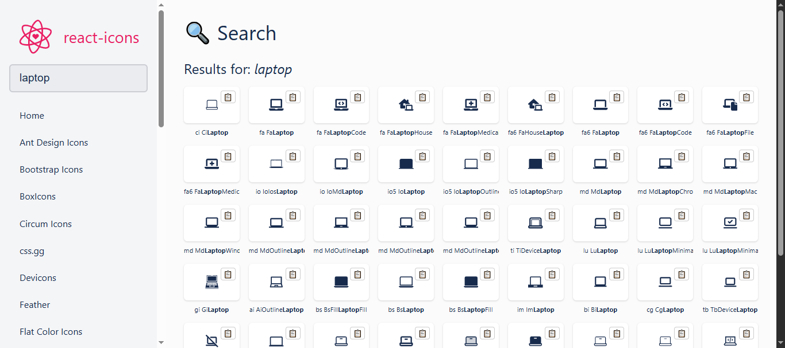

# SVG Copy Extension for React-Icons

A Chrome extension that adds a 📋 copy button to each SVG icon on the [React-Icons website](https://react-icons.github.io/), allowing you to easily copy the SVG code for use in your projects.

---

## Features

- **Copy SVG Instantly:** Adds a small copy button to every icon. Click to copy the SVG code to your clipboard.
- **Works with Search:** Automatically updates copy buttons when you search or filter icons.
- **Simple & Fast:** No extra UI, just a seamless experience on the React-Icons site.
- **Popup Info:** Click the extension icon to see info about the extension and the developer.

---

## How It Works

- The extension injects a content script (`content.js`) into the React-Icons website.
- It finds all icon SVGs and adds a 📋 button to each.
- Clicking the button copies the SVG code (with proper `xmlns` attribute) to your clipboard.
- The extension observes page changes (like searching) and keeps the copy buttons updated.

---

## Installation

1. **Clone or Download this Repository**

   ```
   git clone git@github.com:hassaanhaider88/react-icons-svg.git
   ```

2. **Open Chrome and Go to Extensions**

   - Visit `chrome://extensions/`
   - Enable **Developer mode** (top right)

3. **Load Unpacked Extension**

   - Click **Load unpacked**
   - Select the folder where you cloned/downloaded this project

4. **Pin the Extension (Optional)**

   - Click the puzzle icon in Chrome’s toolbar and pin "SVG Copy By HMK CodeWeb" for quick access.

---

## Usage

1. **Go to [React-Icons Website](https://react-icons.github.io/)**
2. Hover over any icon — you’ll see a 📋 button in the corner.
3. Click the 📋 button to copy the SVG code to your clipboard.
4. Paste the SVG code wherever you need it!

---

## Files Overview

- `manifest.json`  
  Chrome extension manifest (v3), defines permissions, scripts, and popup.

- `content.js`  
  Content script that injects copy buttons and handles clipboard logic.

- `popup.html`  
  The popup shown when you click the extension icon. Contains info and links.

- `icons/HMK_CodeWeb.jpeg`  
  Icon for the extension (used in the toolbar and popup).

---

## Customization

- **Change the Icon:**  
  Replace `icons/HMK_CodeWeb.jpeg` with your own image (16x16, 32x32, etc. recommended).

- **Change Popup Info:**  
  Edit `popup.html` to update developer info, links, or add more instructions.

---

## Developer

**Hassaan Haider**  
- 🌐 [Portfolio](https://hassaan-haider.netlify.app/)
- 📧 hassaanhaider088@gmail.com

---

## License

This project is open source and free to use for personal and commercial projects.

---

## Screenshots

  


---

## Troubleshooting

- **Copy button not showing?**
  - Make sure you are on [https://react-icons.github.io/](https://react-icons.github.io/)
  - Reload the page after installing the extension.
  - Check that the extension is enabled in Chrome.

- **Icon not showing in toolbar?**
  - Make sure the icon path in `manifest.json` is correct and the file exists.

---

## Contributing

Pull requests and suggestions are welcome!  
Feel free to fork this repo and make it even better.

---

**Made with ❤️ for developers & designers.**